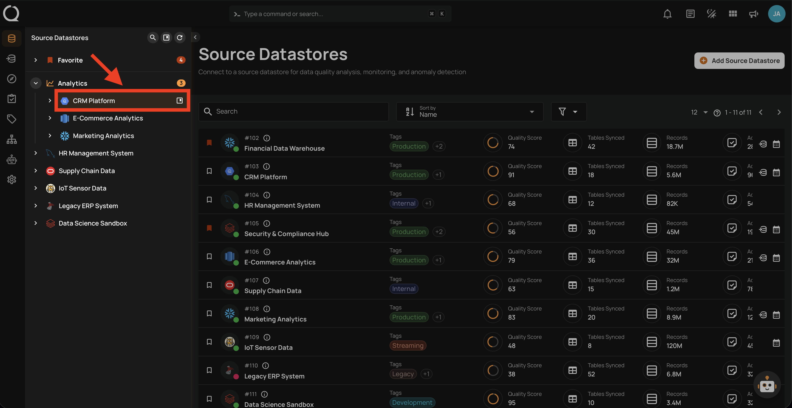
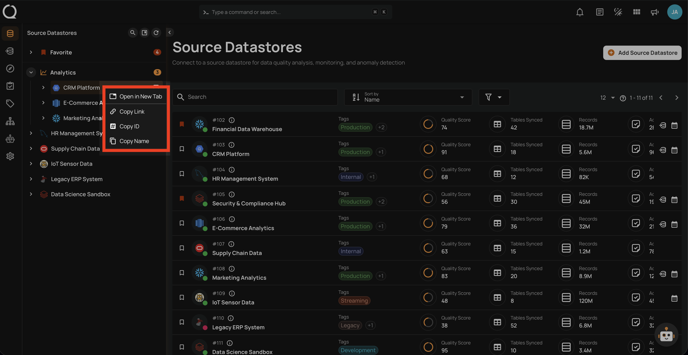
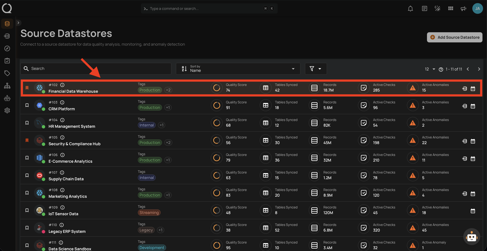
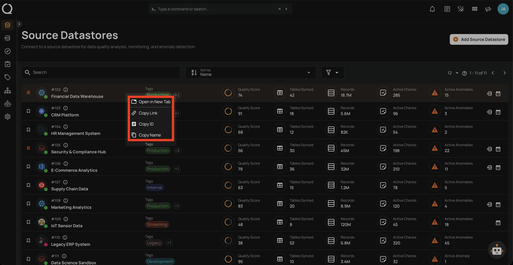
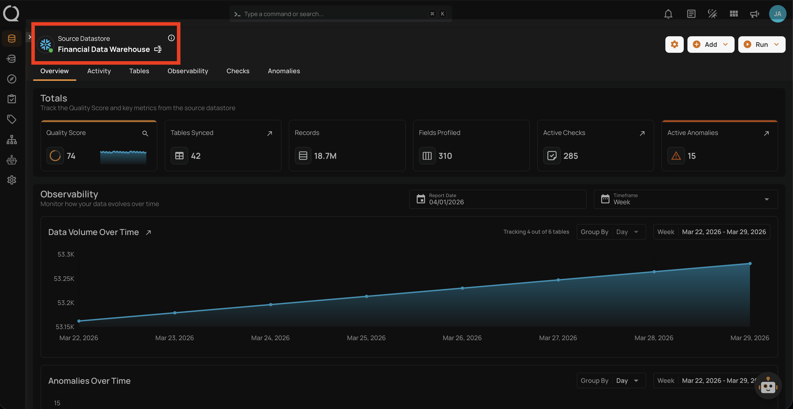
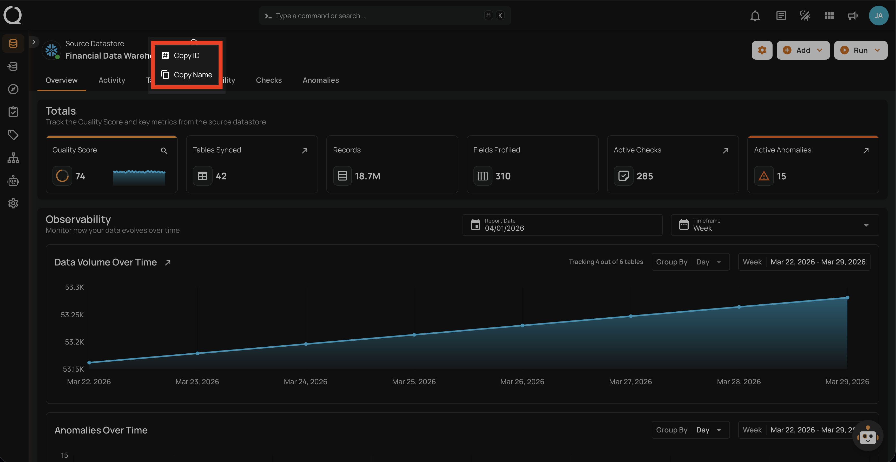

# Datastore Right Click Options

Qualytics provides right-click context menu options on **source datastores** across the platform. These options give you quick access to navigation and clipboard actions without needing to open a datastore first.

!!! tip "Keyboard Shortcuts"
    Prefer the keyboard? Many datastore actions are also available via shortcuts. See the [Keyboard Shortcuts](keyboard-shortcuts.md){:target="_blank"} page.

## Available Options

The following options are available when right-clicking on a source datastore:

| Option | Icon | Description | Use Case |
| :--- | :--- | :--- | :--- |
| **Open in New Tab** | :material-tab: | Opens the datastore in a new browser tab. | Compare two datastores side by side or keep your current page open. |
| **Copy Link** | :material-link-variant: | Copies the datastore URL to your clipboard. | Share a direct link with a teammate via Slack, email, or documentation. |
| **Copy ID** | :material-pound-box: | Copies the datastore ID to your clipboard. | Use the ID in API calls, automation scripts, or support tickets. |
| **Copy Name** | :material-content-copy: | Copies the datastore name to your clipboard. | Reference the datastore name in reports, tickets, or search queries. |

## Where It Works

The context menu is available in three locations. The **Tree View** and **Datastore Listing** provide all four options, while the **Breadcrumb** provides a reduced set.

### Tree View

Right-click on any source datastore in the left sidebar tree view:

### Datastore Listing

Right-click on any datastore row in the Source Datastores listing page:

### Breadcrumb

Right-click on the datastore name in the breadcrumb (top-left corner of the datastore overview page):

!!! note
    The breadcrumb context menu only includes **Copy ID** and **Copy Name** — since you are already on the datastore page, **Open in New Tab** and **Copy Link** are not needed.
