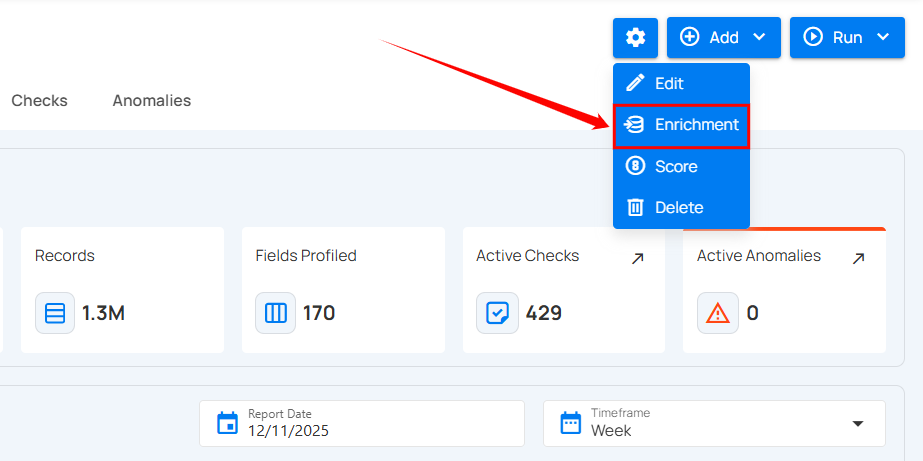
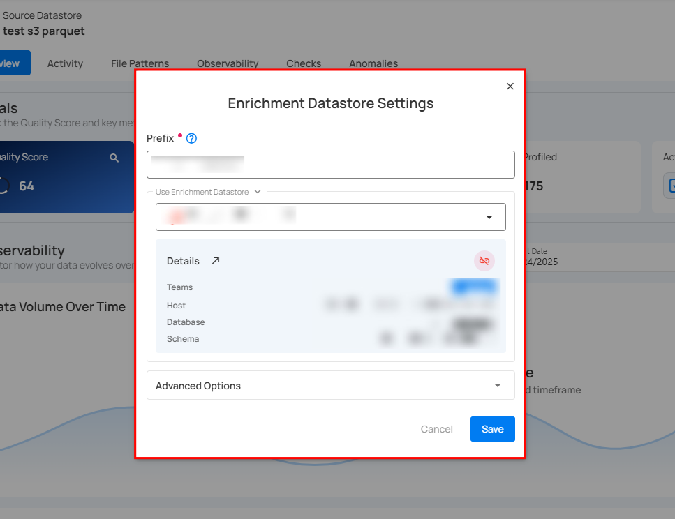
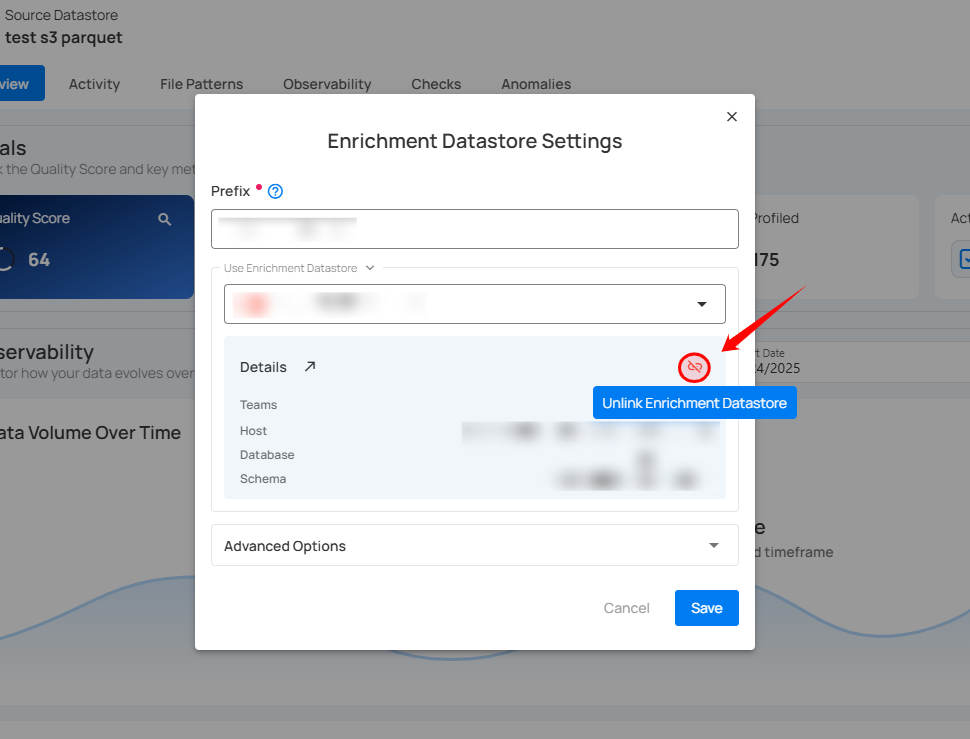
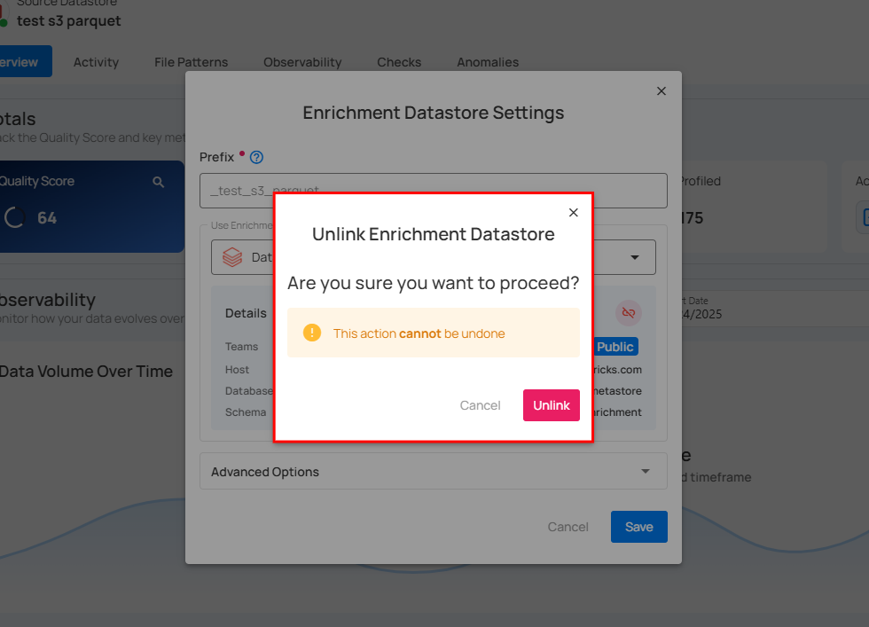
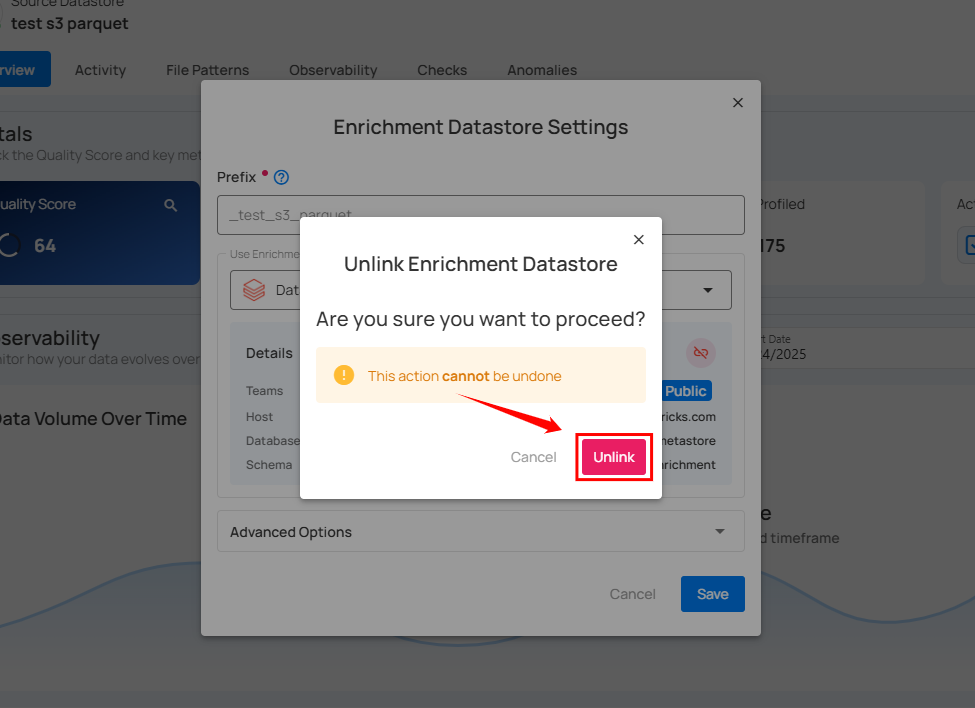

# Unlink Enrichment Datastore

**Step 1:** Click on the **Enrichment** from the drop-down list.

A modal window titled **Enrichment Datastore Settings** will appear, displaying configuration options for the linked enrichment datastore.

**Step 2:** Click the **Unlink Enrichment Datastore** option (represented by **unlink** icon) located on the right side of the Details section to remove the linked enrichment datastore.

A modal window titled **Unlink Enrichment Datastore** will appear.

**Step 3:** Click the **Unlink** button to remove the enrichment datastore connection.

After clicking the **Unlink** button, a success message confirms that the datastore has been updated successfully.

