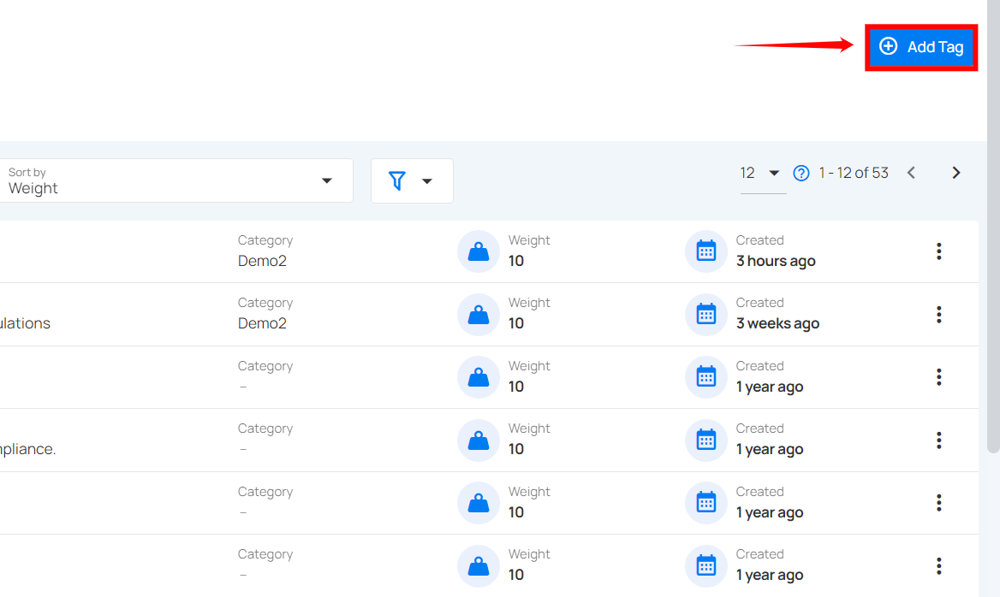
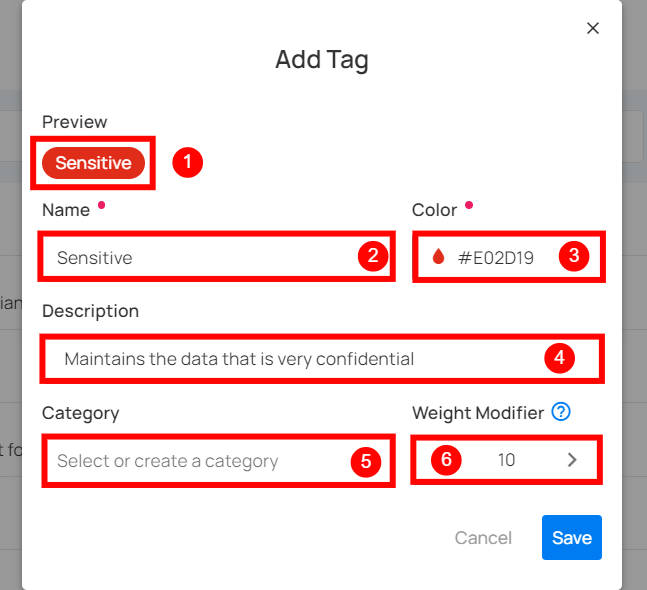
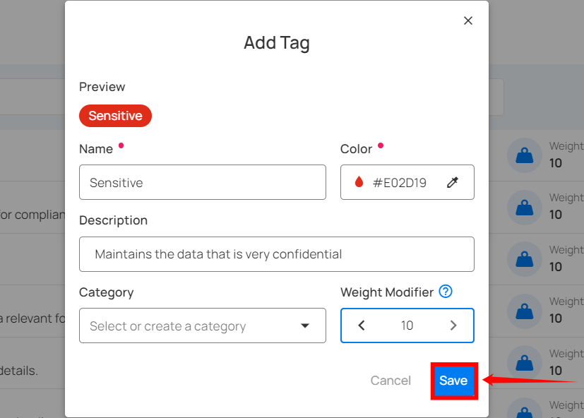
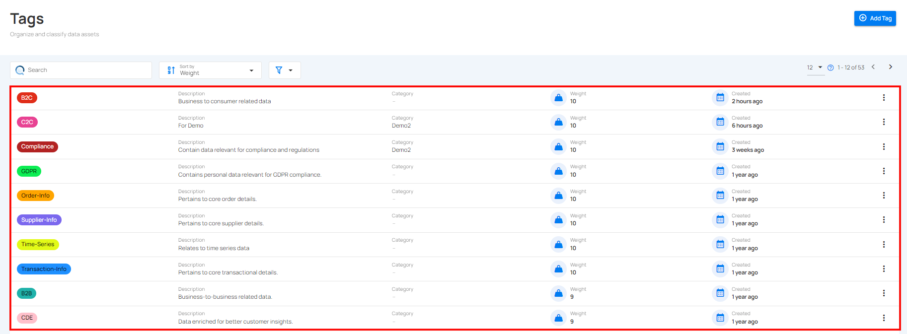

## Add Tag

**Step 1**: Click on the **Add Tag** button from the top right corner.

**Step 2**: A modal window will appear, providing the options to create the tag. Enter the required values to get started. 

| REF. | FIELD | ACTION | EXAMPLE |
|------|-----------------|-------------------|----------------|
| 1.   | Preview | This shows how the tag will appear to users. | Preview |
| 2.   | Name | Assign a name to your tag. | Sensitive  |
| 3.   | Color | A color picker feature is provided, allowing you to select a color using its hex code.|  #E74C3C |
| 4.   | Description | Explain the nature of your tag. | Maintain data that is highly confidential and requires strict access controls.|
| 5.   | Category | Choose an existing category or create a new one to group related tags for easier organization.|Demo2|
| 6.   | Weight Modifier | Adjust the tag's weight for prioritization, where a higher value represents greater significance. The range is between -10 and 10.| 10 |

**Step 3**: Click on the **Save** button to save your tag.

After clicking the **Save** button, the tag will be added to the system and a success message will appear.

### View Created Tags

Once you have created a tag, you can view it in the tags list.

