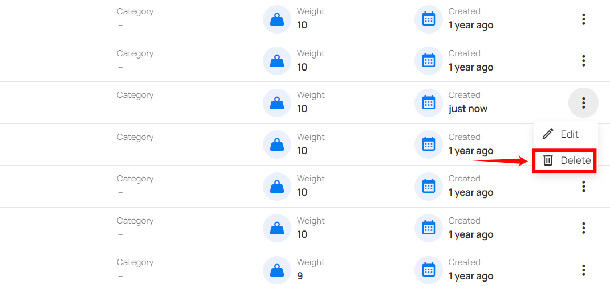

### Delete Tags

This allows you to remove outdated or unnecessary tags to maintain a clean and efficient tag system.

**Step 1**: Click the **vertical ellipsis (⋮)** next to the tag that you want to delete, then click on **Delete** from the dropdown menu.

**Step 2**: After clicking the **Delete** button, your tag will be removed from the system, and a success message will appear.