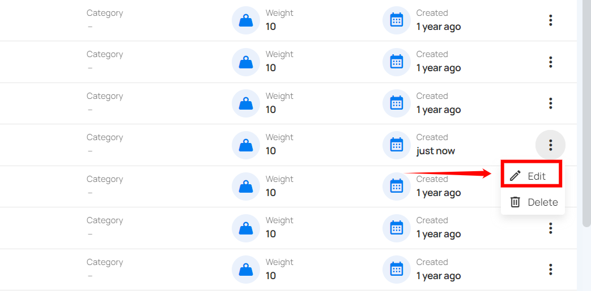
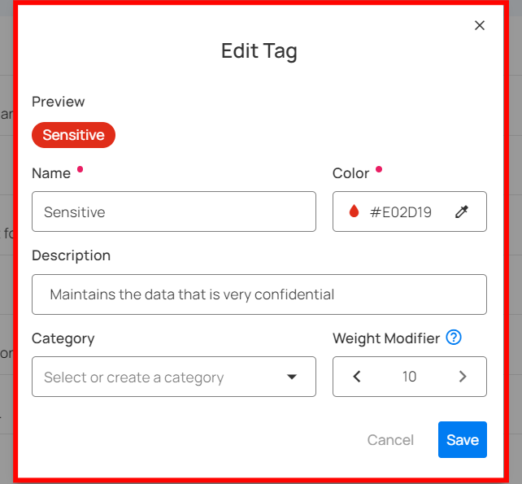
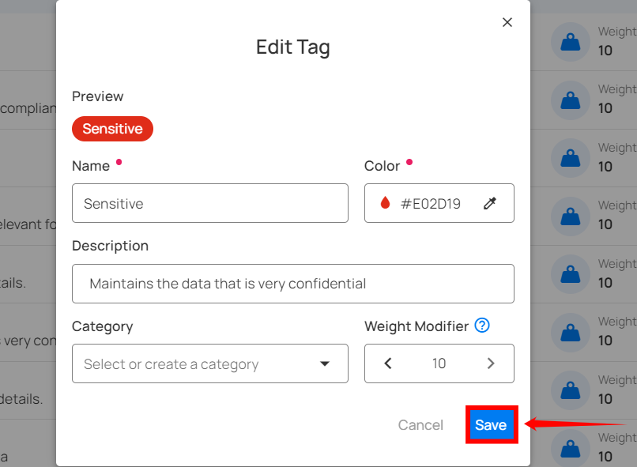

# Edit Tags

This allows you to keep your tags updated with current information and relevance.

**Step 1**: Click the **vertical ellipsis (⋮)** next to the tag that you want to edit, then click on **Edit** from the dropdown menu.

**Step 2**: Edit the tag's **name**, **color**, **description**, **category** and **weight** as needed.

**Step 3**: Click the **Save** button to apply your changes.

**Step 4**: After clicking the **Save** button, a success message will appear.