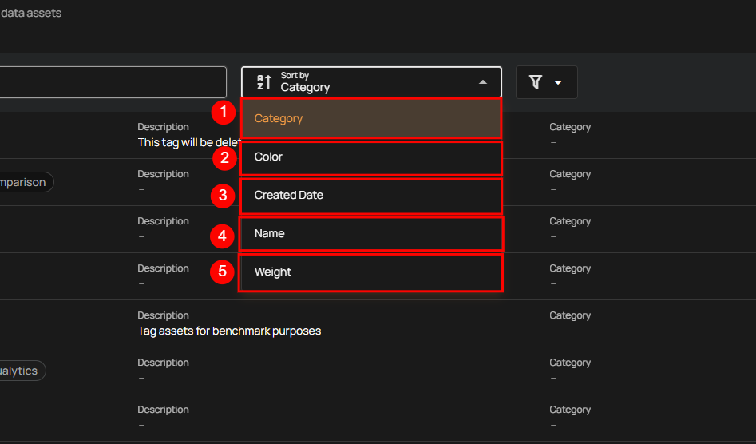
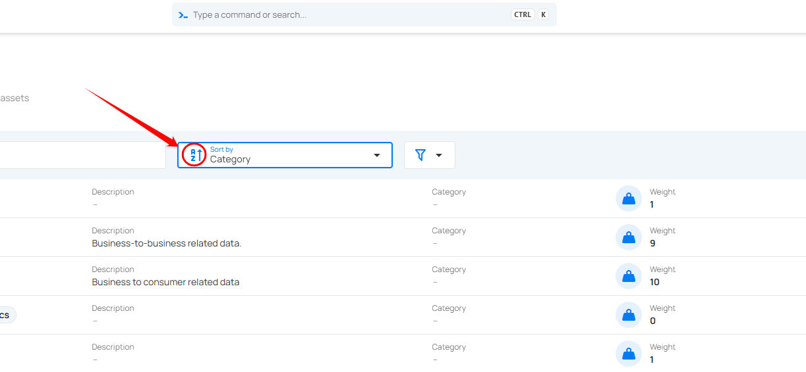
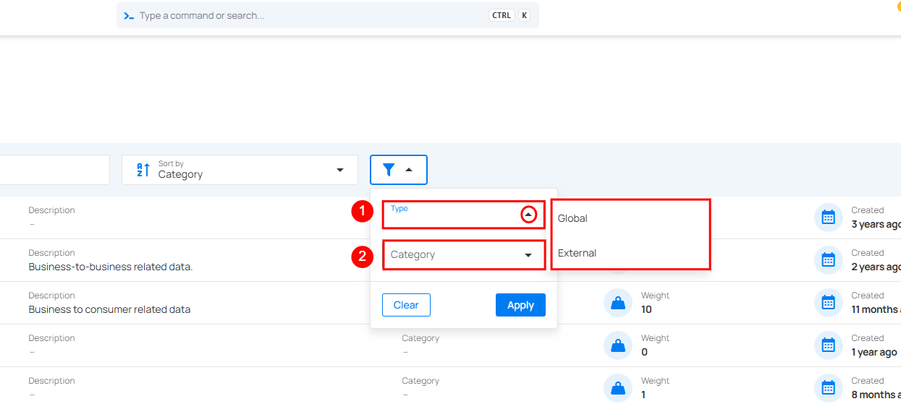

# Filter and Sort 

Qualytics allows you to sort and filter your tags so that you can easily organize and find the most relevant tags according to your criteria, improving data management and workflow efficiency.

### Sort

You can sort your tags by **Category**, **Color**, **Created Date**, **Name**, and **Weight** to easily organize and prioritize them according to your needs.

| **No.** | **Sort Option** | **Description** |
|:-------:|------------------|------------------|
| **1** | **Category** | Sort tags based on their assigned category. |
| **2** | **Color** | Sort tags according to their color label. |
| **3** | **Created Date** | Sort tags by the date they were created. |
| **4** | **Name** | Sort tags alphabetically by name. |
| **5** | **Weight** | Sort tags based on their assigned weight value. |

Whatever sorting option is selected, you can arrange the data either in ascending or descending order by clicking the caret button next to the selected sorting criteria.

### Filter 

You can filter your tags by type and category, which allows you to categorize and manage them more effectively. 

 
| **No.** | **Filter Option** | **Description** |
|:-------:|------------------|-----------------|
| **1** | **Type** | Filter tags based on their origin.     **[External](../tags/external-tag.md):** Imported automatically from integrated catalog systems like *[Atlan](../settings/catalog-integrations/atlan.md)* or *[Alation](../settings/catalog-integrations/alation.md)* via API. These tags cannot be manually created or edited and ensure consistent tagging across connected platforms.     **Global:** Created and managed directly within Qualytics. Used internally to organize datasets and unaffected by external integrations unless the *Overwrite Tags* option is enabled. |
| **2** | **Category** | Filter tags based on predefined groups or categories, making it easier to locate and manage related tags efficiently. |
