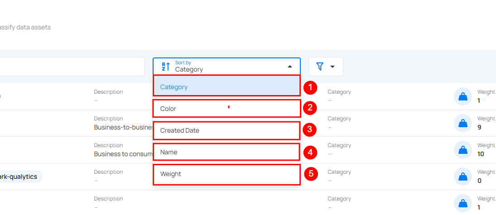

## Filter and Sort 

Qualytics allows you to sort and filter your tags so that you can easily organize and find the most relevant tags according to your criteria, improving data management and workflow efficiency.

### Sort

You can sort your tags by **Color**, **Created Date**, **Name**, and **Weight** to easily organize and prioritize them according to your needs.

### Filter 

You can filter your tags by type and category, which allows you to categorize and manage them more effectively. 
 
#### Filter by Type

 Filter by Type allows you to view and manage tags based on their origin. You can filter between **Global tags** created within the platform and **External tags** imported from integrated systems like Atlan or Alation.

1. **External Tags**: External tags are metadata labels imported from an integrated data catalog system, such as Atlan or Alation, into Qualytics. These tags are synchronized automatically via API integrations and cannot be created or edited manually within Qualytics. They help ensure consistency in data tagging across different platforms by using the same tags already established in the data catalog. **Example**: If Atlan has a tag named **Customer,** once integrated, this tag will automatically be synchronized and added to Qualytics as an external tag.

2. **Global Tags**: Global tags are metadata labels that are created and managed directly within Qualytics. These tags are not influenced by external integrations and are used internally within the Qualytics platform to organize and categorize data according to the users' requirements. **Example**: A tag created within Qualytics to mark datasets that need internal review. This tag is fully managed within the Qualytics platform and remains unaffected by external data catalog systems unless the Overwrite Tags option is enabled in the Integration configuration.

#### Filter by Category

**Filter by Category** allows you to organize and manage tags based on predefined groups or categories. By applying this filter, you can quickly locate tags that belong to a specific category, improving searchability and making it easier to manage large volumes of data.

