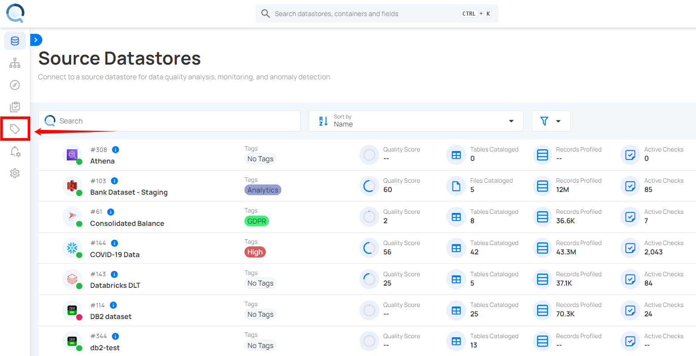
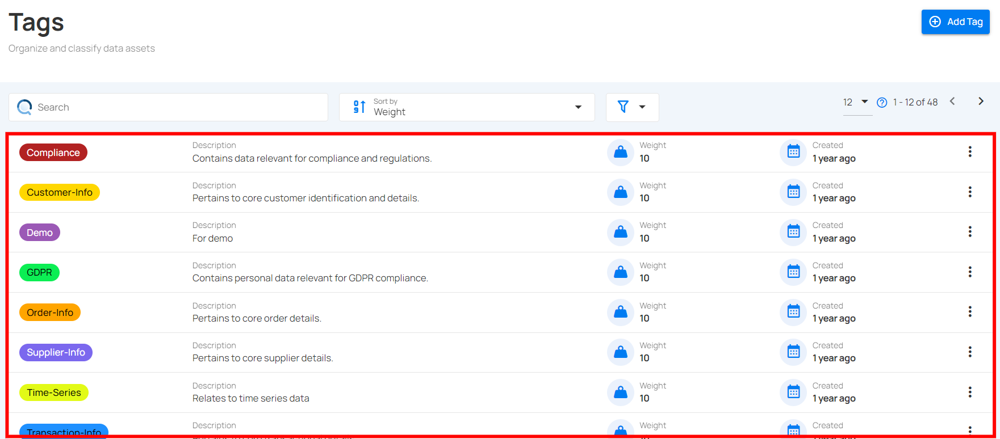

# Tags

Tags allow users to categorize and organize data assets effectively and provide the ability to assign weights for prioritization. They drive notifications and downstream workflows, enabling users to stay informed and take appropriate actions. Tags can be configured and associated with specific properties, allowing for targeted actions and efficient management of entities across multiple datastores. 

Tags can be applied to Datastores, Profiles, Fields, Checks, and Anomalies, streamlining data management and improving workflow efficiency. Overall, tags enhance organization, prioritization, and decision-making.

Let’s get started 🚀

## What Are Tags and Why They Matter

A **Tag** is a reusable label that you can assign to Datastores, Profiles, Fields, Checks, and Anomalies.
Tags bring **consistency, context, and automation** to your data workflows.

### Why We Use Tags

Without tags, managing hundreds of data assets quickly becomes difficult. Tags help you:

- **Categorize assets** logically (e.g., `Finance`, `PII`, `Deprecated`).
- **Identify priorities** by applying weight values.
- **Filter views and dashboards** for faster navigation.
- **Automate responses** in Flows (e.g., alert when a “Critical” check fails).
- **Enforce governance** by grouping data by sensitivity or ownership.

In short, Tags help you *find what matters faster* and *act automatically* based on context.

## How Tags Work

Tags can be applied across the full data hierarchy in Qualytics:

- **Datastore level:** Applies to the entire data source and cascades to all related assets.  
- **Container (Table/View):** Inherits from the parent datastore and passes tags to its fields and checks.  
- **Field:** Reflects any inherited or directly applied tags.  
- **Check:** Inherits from the container or datastore; defines context for anomalies.  
- **Anomaly:** Inherits tags from the failed check when it’s created.

### Tag Inheritance

Inheritance ensures consistency:

- If a tag named **Critical** is applied to a Datastore, it automatically applies to all its Containers, Fields, and Checks.  
- When a Check fails, the resulting Anomaly inherits the same **Critical** tag.  
- If you remove the **Critical** tag from the parent datastore, all child assets lose that tag. Removal also triggers background propagation (same delay as adding).
- However, existing Anomalies keep the tag they inherited when they were created (no retroactive removal).
- When tags are added or removed, container and field weights are recalculated. Quality scores are updated the next time a scan runs — tag changes do not trigger an immediate score recalculation.

!!! note
    Tag inheritance occurs only downward (from parent to child).
    Anomalies inherit tags at creation time only — subsequent tag updates do not propagate automatically.

!!! info "Propagation Timing"
    When you apply or remove a tag from a datastore or container, the change propagates to child entities in the background. This usually happens within seconds, but may take a moment under heavy load. If you don't see the tag on child assets immediately, wait a few seconds and refresh.

## Real-Life Example

Imagine your organization manages multiple Datastores — *Customer Data*, *Transactions*, and *Logs.*

Here’s how Tags make this easier:

- You apply a **PII** tag to all fields containing personal data (e.g., email, phone).  
- You apply a **Finance** tag to your *Transactions* datastore, which cascades to all related fields and checks.  
- You assign a **Critical (Weight: 10)** tag to checks that monitor payment processing errors.

Now your team can:

- Filter anomalies by tag (e.g., view only “Critical” issues).  
- Trigger Flows for specific tags (e.g., auto-alert the Finance team).  
- Generate reports grouped by classification (e.g., all PII fields).  

Additionally:

- You notice your datastore score is low because many tables you don't monitor are dragging it down. You apply a **Monitored (Weight: +10)** tag to the 5 tables you care about. Now those 5 tables dominate the datastore quality score, giving you an accurate picture of the data quality you're responsible for.
- When presenting to stakeholders, you open **Explore**, filter by the **Monitored** tag, and show an aggregate quality score that reflects only your managed tables.

Tags turn scattered data into a structured, actionable map of your ecosystem.

## Understanding Weight Modifier

Each tag includes a **Weight Modifier** — a numeric value between **–10** and **+10** that represents its relative importance.  

| Range | Purpose | Example |
|:------|:---------|:----------|
| –10 to –1 | Lower priority, reduces influence on scores | Deprecated or test data |
| **1 (default)** | **Neutral — default for new tags** | Informational or general tags |
| +2 to +10 | Higher priority, increases influence on scores | Critical, PII, or Production data |

### How Weight Affects the System

- **In Quality Scores:** Containers and fields with higher-weight tags have more influence on aggregate scores. A container with weight 11 (from a +10 tag) has 11x the impact of an untagged container on the datastore score.
- **In Anomaly Triage:** Anomaly severity incorporates tag weights. Higher-weight anomalies appear first in sorted views, helping your team focus on what matters most.
- **In Explore:** Filter by tag to see aggregate quality scores for just the tagged assets — useful for reporting on specific subsets of your data.
- **In Flows:** Tags act as filters in flow trigger conditions. You can configure flows to trigger only for entities matching specific tags (e.g., alert only on "Critical" anomalies).

!!! note
    Tag weight modifiers directly influence quality scores. Containers with higher-weight tags have more influence on the datastore's aggregate score. Fields with higher-weight tags have more influence on their container's dimension scores. Anomaly severity also incorporates tag weights, surfacing higher-weight issues first in triage views.

### How Tag Weights Affect Quality Scores

Tag weight modifiers determine how much each container and field contributes to aggregate quality scores.

**At the datastore level:**

Each container's weight in the datastore quality score formula is calculated from its tags:

```
Container weight = sum of all tag weight modifiers on that container (normalized so minimum is 1)
```

The datastore quality score is a weighted average:

```
Datastore Score = SUM(container score × container weight) / SUM(container weights)
```

**Example:** Your datastore has 50 tables. You tag 3 important tables with "Critical" (weight +10). Each gets weight ~11, while the other 47 remain at weight 1. Your 3 tagged tables now represent about 41% of the aggregate score instead of 6%.

**At the container level:**

Field weights work the same way — fields with higher-weight tags have more influence on the container's dimension scores (completeness, coverage, conformity, etc.).

**For anomaly severity:**

Anomaly weight = sum of rule type weights from failed checks + sum of tag weight modifiers. Higher-weight anomalies surface first in sorted views and triage workflows.

!!! tip "Practical Tip"
    If you're only monitoring a few tables in a large datastore and want the datastore score to reflect those tables, apply a high-weight tag to them. You can also filter by that tag in **Explore** to see an aggregate score for just those tables.

## Scope: User-Level or System-Level?

Qualytics supports both **system-wide** and **user-specific** tags.

**Global Tags** are system-wide — once created, they're visible to all users with permission. They have weight modifiers and affect quality scores.

**Personal Tags** are user-specific — only you can see your own personal tags. They don't affect scoring or automation, and are useful for organizing your personal workflow. Think of them as personal bookmarks.

### Types of Tags

| Type | Description | Editable? | Special Features |
|:-----|:------------|:----------|:-----------------|
| **Global** | Standard user-created tags | Yes | General purpose, affects quality scores |
| **Entity** | Entity classification tags | Yes | Categorize by entity type |
| **Lineage** | Hierarchical tags with parent-child relationships | Yes | Supports tree structures for lineage tracking |
| **External** | Imported from catalog integrations (Alation, Atlan, Purview) | Read-only | Linked to source integration |

## Use Cases

| Scenario | Example | Benefit |
|:-----------|:-----------|:-----------|
| **Data Classification** | Tag all personal data fields with `PII`. | Simplifies privacy compliance checks. |
| **Operational Priority** | Tag high-risk checks as `Critical (Weight: 10)`. | Drives targeted alerts and prioritization. |
| **Lifecycle Management** | Tag outdated datasets as `Deprecated`. | Makes cleanup easier and safer. |
| **Automation** | Configure Flows to run only for `Finance` tags. | Enables targeted workflows. |

## Permissions and Security

Tag permissions are determined by **Team Roles** in the Qualytics security model.

### Permission Matrix for Tags

Legend:  
* **✅** → The role *can perform* the action  
* **❌** → The role *cannot perform* the action  

| **Action** | **Reporter** | **Viewer** | **Drafter** | **Author** | **Editor** | **Manager** |
|:------------|:-------------|:------------|:-------------|:-------------|:-------------|:-------------|
| **View Tag** | ✅ | ✅ | ✅ | ✅ | ✅ | ✅ |
| **Apply Existing Tag** | ❌ | ❌ | ❌ | ❌ | ✅ | ✅ |
| **Create Tag** | ❌ | ❌ | ❌ | ❌ | ❌ | ✅ |
| **Edit / Delete Tag** | ❌ | ❌ | ❌ | ❌ | ❌ | ✅ |

## Tags in Flows

Tags can be used in **Flow configurations** to trigger or filter actions.

### Example Use Cases

- Run a Flow **only for Checks tagged “Critical.”**  
- Send Slack alerts **for Anomalies tagged “PII.”**  
- Trigger Data Export **for Datastores tagged “Finance.”**

Tags act as metadata filters that determine which entities are included or excluded in automated workflows.

## Navigation to Tags

**Step 1**: Log in to your Qualytics account and click on the **Tags** on the left side panel of the interface. 



You will be navigated to the **Tags** section, where you can view all the tags available in the system.



## Add Tag

!!! note
    For more steps please refer to the [add tag documentation](../tags/add-tag.md).

## Applying a Tag

!!! note
    For more steps please refer to the [applying a tag documentation](../tags/applying-a-tag.md).

## External Tag

!!! note
    For more information refer to the [external tag](../tags/external-tag.md)

## Filter and Sort 

!!! note
    For more steps please refer to the [filter and sort documentation](../tags/filter-and-sort.md).

### Edit Tags

!!! note
    For more steps please refer to the [edit tag documentation](../tags/edit-tag.md).

### Delete Tags

!!! note
    For more steps please refer to the [delete tag documentation](../tags/delete-tag.md).
