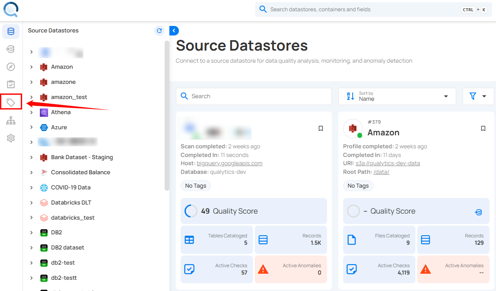
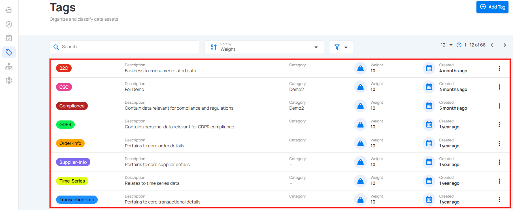

# Tags

Tags allow users to categorize and organize data assets effectively and provide the ability to assign weights for prioritization. They drive notifications and downstream workflows, enabling users to stay informed and take appropriate actions. Tags can be configured and associated with specific properties, allowing for targeted actions and efficient management of entities across multiple datastores. 

Tags can be applied to Datastores, Profiles, Fields, Checks, and Anomalies, streamlining data management and improving workflow efficiency. Overall, tags enhance organization, prioritization, and decision-making.

Let’s get started 🚀

## What Are Tags and Why They Matter

A **Tag** is a reusable label that you can assign to Datastores, Profiles, Fields, Checks, and Anomalies.  
Tags bring **consistency, context, and automation** to your data workflows.

### Why We Use Tags

Without tags, managing hundreds of data assets quickly becomes difficult. Tags help you:

- **Categorize assets** logically (e.g., `Finance`, `PII`, `Deprecated`).
- **Identify priorities** by applying weight values.
- **Filter views and dashboards** for faster navigation.
- **Automate responses** in Flows (e.g., alert when a “Critical” check fails).
- **Enforce governance** by grouping data by sensitivity or ownership.

In short, Tags help you *find what matters faster* and *act automatically* based on context.

## How Tags Work

Tags can be applied across the full data hierarchy in Qualytics:

- **Datastore level:** Applies to the entire data source and cascades to all related assets.  
- **Container (Table/View):** Inherits from the parent datastore and passes tags to its fields and checks.  
- **Field:** Reflects any inherited or directly applied tags.  
- **Check:** Inherits from the container or datastore; defines context for anomalies.  
- **Anomaly:** Inherits tags from the failed check when it’s created.

### Tag Inheritance

Inheritance ensures consistency:

- If a tag named **Critical** is applied to a Datastore, it automatically applies to all its Containers, Fields, and Checks.  
- When a Check fails, the resulting Anomaly inherits the same **Critical** tag.  
- If you remove the **Critical** tag from the parent datastore, all child assets lose that tag.  
- However, existing Anomalies keep the tag they inherited when they were created (no retroactive removal).

!!! note
    Tag inheritance occurs only downward (from parent to child).  
    Anomalies inherit tags at creation time only — subsequent tag updates do not propagate automatically.

## Real-Life Example

Imagine your organization manages multiple Datastores — *Customer Data*, *Transactions*, and *Logs.*

Here’s how Tags make this easier:

- You apply a **PII** tag to all fields containing personal data (e.g., email, phone).  
- You apply a **Finance** tag to your *Transactions* datastore, which cascades to all related fields and checks.  
- You assign a **Critical (Weight: 10)** tag to checks that monitor payment processing errors.

Now your team can:

- Filter anomalies by tag (e.g., view only “Critical” issues).  
- Trigger Flows for specific tags (e.g., auto-alert the Finance team).  
- Generate reports grouped by classification (e.g., all PII fields).  

Tags turn scattered data into a structured, actionable map of your ecosystem.

## Understanding Weight Modifier

Each tag includes a **Weight Modifier** — a numeric value between **–10** and **+10** that represents its relative importance.  

| Range | Purpose | Example |
|:------|:---------|:----------|
| –10 to –1 | Low priority | Deprecated or test data |
| 0 | Neutral | Informational or general tags |
| +1 to +10 | High priority | Critical, PII, or Production data |

### How Weight Affects the System

- **In Dashboards:** Higher-weight tags appear first in sorted lists and visualizations.  
- **In Checks:** High-weight tags help prioritize anomaly reviews and notifications.  
- **In Flows:** Tags can be used to trigger automated actions for higher-priority data.

!!! note 
    Weight values affect prioritization and filtering, not computation or scoring.

## Scope: User-Level or System-Level?

Tags in Qualytics are **system-wide**, not user-specific.  
Once created, a tag becomes available for all users who have permission to view or apply it.

### Types of Tags

- **Global Tags:** Created manually inside Qualytics. Editable by permitted roles and visible to all teams.  
- **External Tags:** Imported automatically from integrated catalog systems like **Atlan** or **Alation**.  
  These cannot be edited or deleted in Qualytics and remain read-only.

## Use Cases

| Scenario | Example | Benefit |
|:-----------|:-----------|:-----------|
| **Data Classification** | Tag all personal data fields with `PII`. | Simplifies privacy compliance checks. |
| **Operational Priority** | Tag high-risk checks as `Critical (Weight: 10)`. | Drives targeted alerts and prioritization. |
| **Lifecycle Management** | Tag outdated datasets as `Deprecated`. | Makes cleanup easier and safer. |
| **Automation** | Configure Flows to run only for `Finance` tags. | Enables targeted workflows. |

## Permissions and Security

Tag permissions are determined by **Team Roles** in the Qualytics security model.

### Permission Matrix for Tags

Legend:  
* **✅** → The role *can perform* the action  
* **❌** → The role *cannot perform* the action  

| **Action** | **Reporter** | **Viewer** | **Drafter** | **Author** | **Editor** |
|:------------|:-------------|:------------|:-------------|:-------------|:-------------|
| **Create Tag** | ❌ | ❌ | ❌ | ❌ | ✅ |
| **Edit / Delete Tag** | ❌ | ❌ | ❌ | ❌ | ✅ |
| **Apply Existing Tag** | ✅ | ✅ | ✅ | ✅ | ✅ |
| **View Tag** | ✅ | ✅ | ✅ | ✅ | ✅ |

## Tags in Flows

Tags can be used in **Flow configurations** to trigger or filter actions.

### Example Use Cases

- Run a Flow **only for Checks tagged “Critical.”**  
- Send Slack alerts **for Anomalies tagged “PII.”**  
- Trigger Data Export **for Datastores tagged “Finance.”**

Tags act as metadata filters that determine which entities are included or excluded in automated workflows.

## Navigation to Tags

**Step 1**: Log in to your Qualytics account and click on the **Tags** on the left side panel of the interface. 

You will be navigated to the **Tags** section, where you can view all the tags available in the system.

## Add Tag

!!! note
    For more steps please refer to the [add tag documentation](../tags/add-tag.md).

## Applying a Tag

!!! note
    For more steps please refer to the [applying a tag documentation](../tags/applying-a-tag.md).

## External Tag

!!! note
    For more information refer to the [external tag](../tags/external-tag.md)

## Filter and Sort 

!!! note
    For more steps please refer to the [filter and sort documentation](../tags/filter-and-sort.md).

### Edit Tags

!!! note
    For more steps please refer to the [edit tag documentation](../tags/edit-tag.md).

### Delete Tags

!!! note
    For more steps please refer to the [delete tag documentation](../tags/delete-tag.md).
