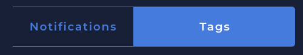
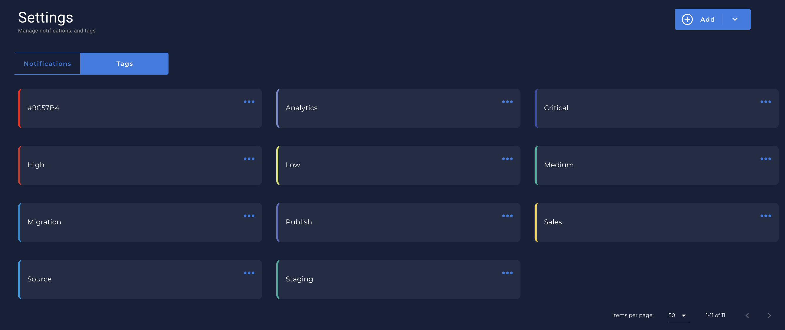
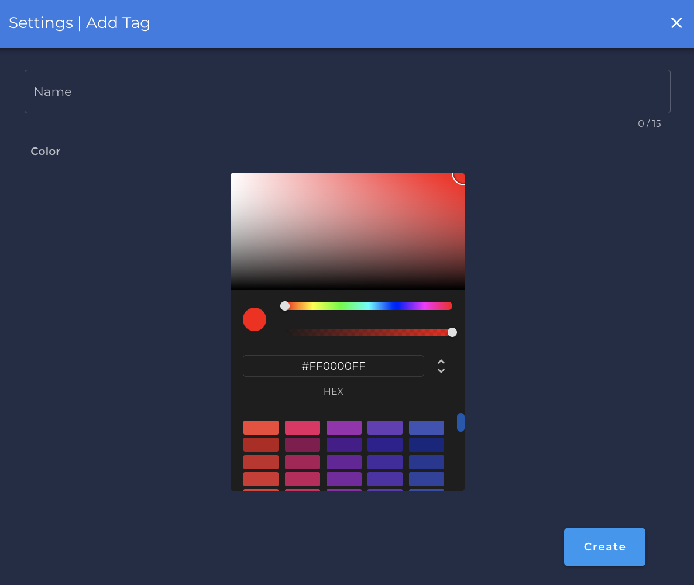

# What is Tag?

* A tag is a label that you can add a color and a description of what it means.

---

* You can find the `Tag` section clicking in `Settings` in the menu bar:
    - {: style="height:450px"}

* Once clicked in `Settings` you can see the `Tag` tab:
    - {: style="width:230px"}

* You can see all the `tags` that you created or `add` a new one:
    - 

---

# Create a Tag

* In the right top of the `Tag` screen, you can see `Add` button.
    - {: style="width:130px"}

* Once you have clicked to add a new `Tag` a new screen will show up to you:
    - 

    * `Name` is the name of your tag.
    * `Color Pickup`:
        * You can select any color you want for your specific Tag.
        * You can use Hexadecimal number or select by clicking in the color picker.
    
* You can use a tag in most part of the Qualytics App:
    * `Quality Check`.
    * `Notification`.
    * `Tables`.
    * `Data Stores`
    * `Enrichment Store`.
    * Etc...